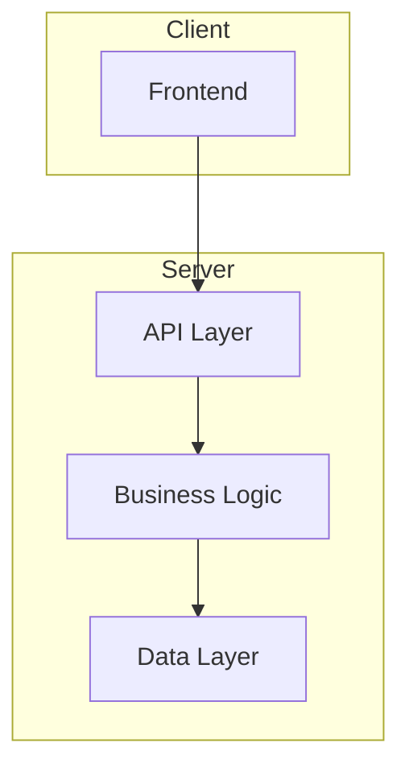
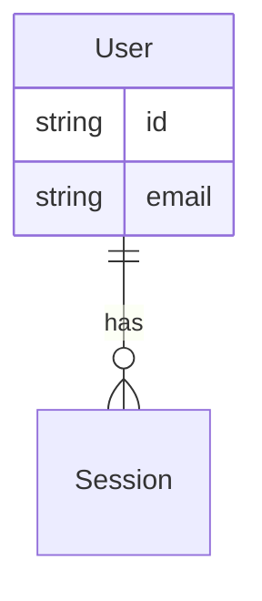

# Create Architecture - System Design Workflow

Guides creation of comprehensive architecture documents from PRD requirements.

## Overview

This skill:
- Analyzes PRD for technical requirements
- Explores existing codebase patterns
- Designs component architecture
- Creates architecture decision records

## Prerequisites

- PRD must exist at `_prism/planning/prd.md`
- For existing projects, understand current patterns

## Instructions

### Step 1: Analyze Requirements

Read PRD and extract:
- Technical requirements (performance, scale, security)
- Integration points
- Technology constraints
- Quality attributes

### Step 2: Explore Codebase (existing projects)

- Find existing patterns and conventions
- Identify reusable components
- Note current architecture constraints
- Look for similar feature implementations

### Step 3: Design Architecture

Create the design with:
- Component structure and responsibilities
- Data models and relationships
- Integration points and APIs
- Technology choices with rationale

### Step 4: Document

Write to `_prism/architecture/architecture.md`:

```markdown
# Architecture: [Feature/System Name]

## Overview
[High-level description of the solution and key decisions]

## Architecture Diagram



## Components

### [Component Name]
- **Responsibility**: [Single responsibility description]
- **Location**: `path/to/component/`
- **Dependencies**: [Other components it uses]
- **Interface**: [Key methods/APIs exposed]

### [Component 2]
...

## Data Model



## Integration Points

| External System | Integration Method | Purpose |
|-----------------|-------------------|---------|
| [System] | REST/GraphQL/etc | [Why] |

## Security Considerations
- [Authentication approach]
- [Authorization model]
- [Data protection measures]

## Build Sequence

1. [ ] [First component - foundation]
2. [ ] [Second component - depends on 1]
3. [ ] [Third component - depends on 1,2]
...

## Trade-offs

| Decision | Alternative | Why Chosen |
|----------|-------------|------------|
| [Choice made] | [Rejected option] | [Rationale] |

## Risks & Mitigations

| Risk | Impact | Mitigation |
|------|--------|-----------|
| [Risk] | [High/Med/Low] | [How to address] |
```

### Step 5: Create Stories

After architecture approval, create stories for each build sequence item:

```bash
# Update epic with architecture reference
bd update <epic-id> --notes "Architecture approved: _prism/architecture/architecture.md"

# Create stories for build sequence
bd create "Story: [Component 1]" -p 1 --type task --parent <epic-id>
bd create "Story: [Component 2]" -p 1 --type task --parent <epic-id>

# Add dependencies based on build sequence
bd dep add <story-2-id> <story-1-id>
```

## Output

- `_prism/architecture/architecture.md` - Complete architecture document
- Beads stories for each component in build sequence

## Quality Checklist

- [ ] One clear decision per topic (not multiple options)
- [ ] All components have single responsibility
- [ ] Interfaces well-defined
- [ ] Trade-offs documented
- [ ] Build sequence is dependency-aware
- [ ] Stories created in beads
