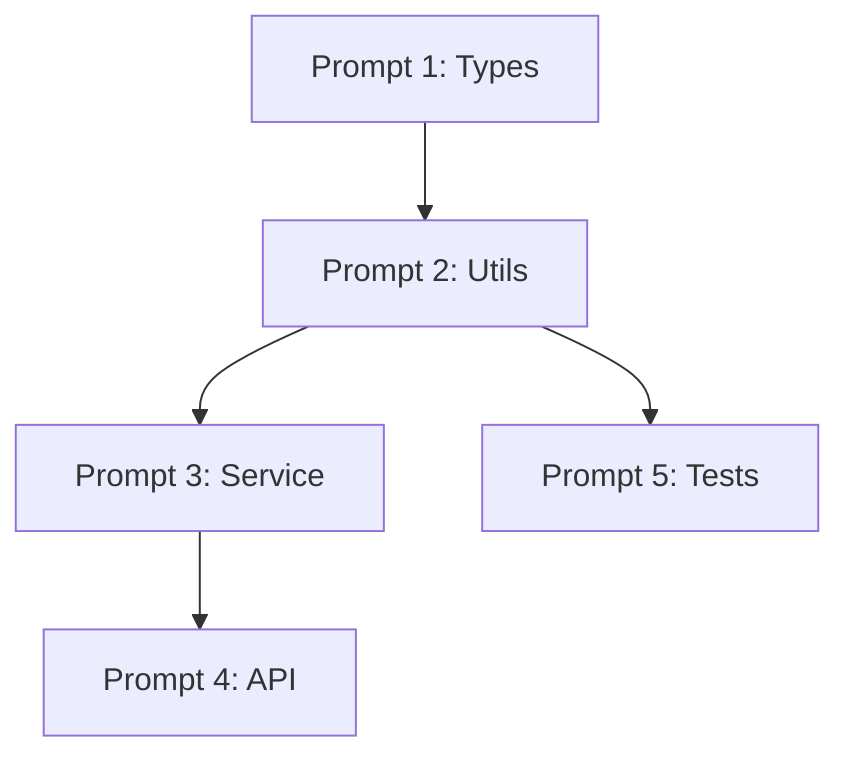

# Create Prompt Plan Skill

## Purpose

Generate a structured sequence of implementation prompts from approved architecture, creating a step-by-step guide that can be executed one at a time.

## When to Use

- After architecture is approved
- When breaking down implementation into steps
- Before `/prism-implement` phase begins

## Prompt Plan Process

### Step 1: Read Architecture

Load the architecture document:
- `_prism/architecture/architecture.md`
- Or architecture from PRD

Extract:
- Components to build
- Dependencies between components
- Integration points
- Testing requirements

### Step 2: Identify Implementation Order

Determine the optimal build order:

1. **Foundation First**: Core utilities, types, configs
2. **Dependencies Before Dependents**: Build what others need first
3. **Testable Units**: Each step should be independently testable
4. **Integration Last**: Connect components after they're built

### Step 3: Generate Prompt Sequence

For each implementation step, create a prompt:

```markdown
## Prompt [N]: [Component Name]

### Context
- Dependencies: [What must exist first]
- Architecture ref: [Link to architecture section]

### Task
[Clear, specific implementation task]

### Deliverables
- [ ] [File to create/modify]
- [ ] [Tests to write]
- [ ] [Integration points]

### Verification
```bash
[Command to verify this step is complete]
```

### Next
After this passes, proceed to Prompt [N+1]
```

### Step 4: Write Prompt Plan

Save to `_prism/architecture/prompt-plan.md`:

```markdown
# Implementation Prompt Plan

## Overview
Total prompts: X
Estimated complexity: [Low/Medium/High]

## Dependencies Graph


## Execution Sequence

### Prompt 1: Foundation Types
[Full prompt content]

---

### Prompt 2: Utility Functions
[Full prompt content]

---

[Continue for all prompts...]
```

### Step 5: Present for Approval

> "I've created an implementation prompt plan with X steps.
> 
> **Build order**:
> 1. [First component]
> 2. [Second component]
> ...
>
> **Key dependencies**:
> - [Component A] must be built before [Component B]
>
> Does this sequence look correct?"

## Template

See `templates/prompt-plan.md` for the full prompt plan template.

## Quality Checklist

- [ ] All architecture components have corresponding prompts
- [ ] Dependencies are ordered correctly (build order)
- [ ] Each prompt is independently executable
- [ ] Each prompt has clear verification step
- [ ] No circular dependencies in plan
- [ ] Tests are included in relevant prompts
