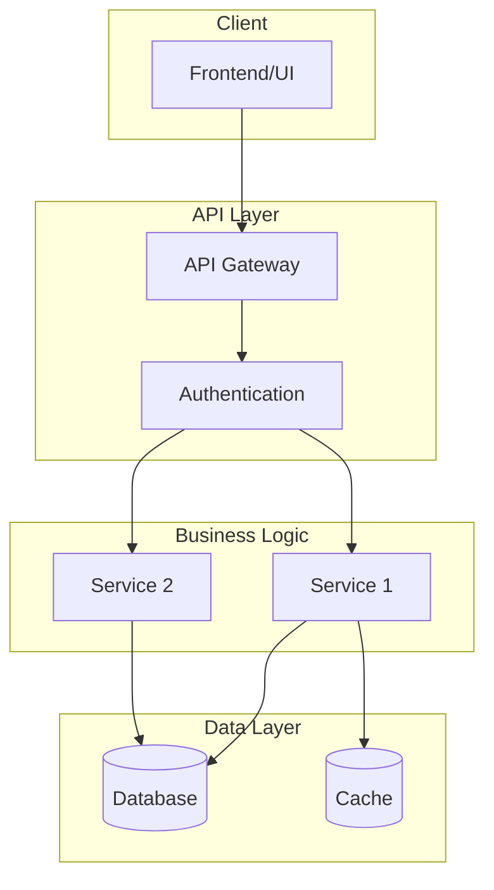
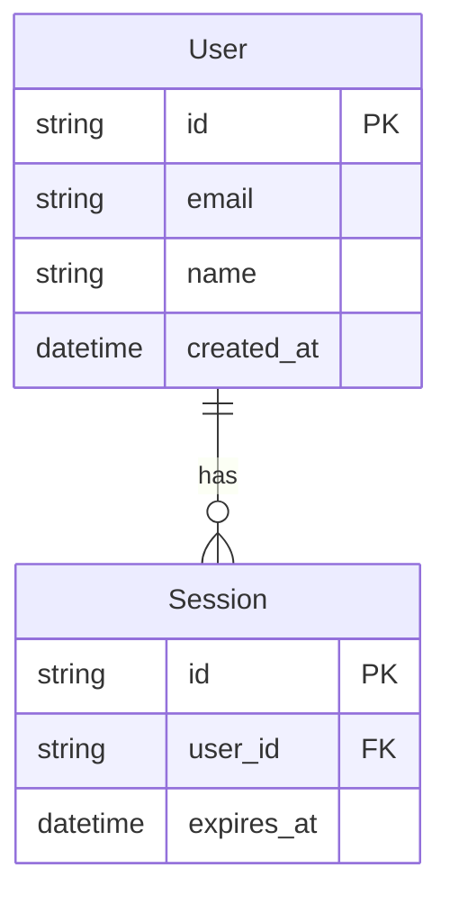

# Architecture: [Feature/System Name]

> **Status**: Draft | Under Review | Approved
> **Created**: [Date]
> **Author**: [Name/Agent]
> **PRD Reference**: [Link to PRD]

---

## Overview

[High-level description of the solution]

**Key Decisions**:
- [Decision 1]: [Brief rationale]
- [Decision 2]: [Brief rationale]

---

## Architecture Diagram

---

## Components

### [Component 1 Name]

| Attribute | Description |
|-----------|-------------|
| **Responsibility** | [Single responsibility] |
| **Location** | `path/to/component/` |
| **Dependencies** | [Other components] |
| **Interface** | [Key methods/APIs] |

### [Component 2 Name]

| Attribute | Description |
|-----------|-------------|
| **Responsibility** | |
| **Location** | |
| **Dependencies** | |
| **Interface** | |

---

## Data Model

### Key Entities

| Entity | Purpose | Storage |
|--------|---------|---------|
| [Entity] | [What it represents] | [Where/how stored] |

---

## Integration Points

| External System | Method | Purpose | Auth |
|-----------------|--------|---------|------|
| [System name] | REST/GraphQL/gRPC | [Why integrated] | [Auth type] |

---

## Security Considerations

### Authentication
[Approach: JWT, Session, OAuth, etc.]

### Authorization
[Model: RBAC, ABAC, etc.]

### Data Protection
- Encryption at rest: [Yes/No, method]
- Encryption in transit: [TLS version]
- PII handling: [Approach]

---

## Performance Considerations

| Concern | Approach | Target |
|---------|----------|--------|
| Latency | [Caching, CDN, etc.] | [<Xms] |
| Throughput | [Scaling strategy] | [X req/s] |
| Memory | [Optimization] | [<X MB] |

---

## Build Sequence

> Order these by dependency (implement upstream first)

- [ ] 1. **[Component/Feature]** - Foundation, no dependencies
- [ ] 2. **[Component/Feature]** - Depends on #1
- [ ] 3. **[Component/Feature]** - Depends on #1, #2
- [ ] 4. **[Component/Feature]** - Depends on #2
- [ ] 5. **[Integration/Testing]** - Depends on all above

---

## Trade-offs

| Decision | Alternative Considered | Why Chosen |
|----------|----------------------|------------|
| [Choice made] | [Rejected option] | [Rationale] |
| [Choice made] | [Rejected option] | [Rationale] |

---

## Risks & Mitigations

| Risk | Impact | Likelihood | Mitigation |
|------|--------|------------|------------|
| [Technical risk] | High/Med/Low | High/Med/Low | [How to address] |

---

## Open Questions

- [ ] [Technical question 1]
- [ ] [Technical question 2]

---

## Appendix

### Technology Stack

| Layer | Technology | Version | Rationale |
|-------|------------|---------|-----------|
| Frontend | [Tech] | [Version] | [Why] |
| Backend | [Tech] | [Version] | [Why] |
| Database | [Tech] | [Version] | [Why] |
| Infrastructure | [Tech] | [Version] | [Why] |

### References

- [Architecture decision records]
- [External documentation]
