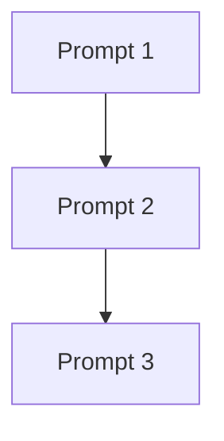

# Prompt Plan Template

## Overview
**Feature**: {{FEATURE_NAME}}
**Total Prompts**: {{COUNT}}
**Complexity**: Low / Medium / High

## Dependencies Graph



---

## Prompt 1: Foundation

### Context
- Dependencies: None (first step)
- Architecture ref: `_prism/architecture/architecture.md#section`

### Task
Create the foundational types and interfaces for {{COMPONENT}}.

### Deliverables
- [ ] `src/types/{{component}}.ts` - Type definitions
- [ ] `src/types/index.ts` - Export types

### Verification
```bash
npm run typecheck
```

### Next
After types compile, proceed to Prompt 2.

---

## Prompt 2: Core Logic

### Context
- Dependencies: Prompt 1 (Types)
- Architecture ref: `_prism/architecture/architecture.md#core-logic`

### Task
Implement the core business logic for {{COMPONENT}}.

### Deliverables
- [ ] `src/{{component}}/service.ts` - Main service
- [ ] `src/{{component}}/utils.ts` - Helper functions
- [ ] `tests/{{component}}/service.test.ts` - Unit tests

### Verification
```bash
npm test -- {{component}}.test.ts
```

### Next
After tests pass, proceed to Prompt 3.

---

## Prompt 3: Integration

### Context
- Dependencies: Prompt 2 (Core Logic)
- Architecture ref: `_prism/architecture/architecture.md#integration`

### Task
Integrate {{COMPONENT}} with existing system.

### Deliverables
- [ ] `src/api/{{component}}.ts` - API endpoint
- [ ] `tests/integration/{{component}}.test.ts` - Integration tests
- [ ] Update `src/index.ts` - Export new module

### Verification
```bash
npm test && npm run build
```

### Next
After build succeeds, implementation is complete.

---

## Execution Summary

| Prompt | Status | Verified |
|--------|--------|----------|
| 1. Foundation | ⬜ Pending | ⬜ |
| 2. Core Logic | ⬜ Pending | ⬜ |
| 3. Integration | ⬜ Pending | ⬜ |

---

*Prompt plan created: {{DATE}}*
*Status: Ready for execution*
