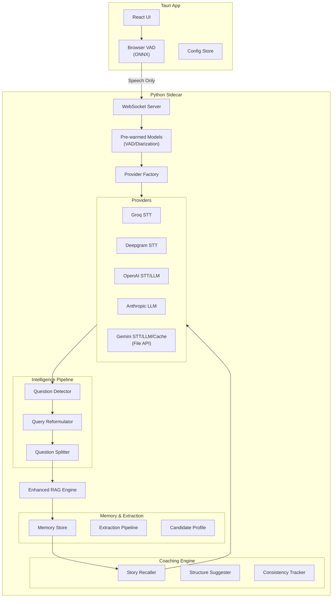

# Live Interview Agent

A cross-platform desktop application that provides real-time AI assistance during job interviews. This tool leverages a sidecar architecture combining a robust Tauri (Rust) backend with a powerful Python AI engine to deliver real-time speech-to-text, context-aware answers, and seamless OS integration.

## Key Features

### Core Capabilities
- **Multi-Provider Support**: Choose from **Groq** (ultra-fast), **Deepgram** (Nova-3), or **Gemini** for STT, and **OpenAI** (GPT-5), **Anthropic** (Claude 4), or **Gemini** (Gemini 3) for LLM reasoning.
- **Real-time Audio Capture & Transcription**: High-accuracy speech recognition with speaker diarization.
- **Context-Aware Assistance**: RAG-powered answers grounded in your resume and job description.
- **Stealth Mode**: Invisible during screen shares.
- **Cross-Platform**: Windows, macOS, and Linux support.

### Intelligence Pipeline (Phase 3)
- **Intelligent Question Detection**: Multi-tier classification of interview questions (behavioral, technical, etc.) with <10ms latency.
- **Multi-Turn Follow-Up Handling**: Advanced query reformulation with TopicStack for resolving references across conversation turns ("that project", "the first topic", "go back to earlier").
- **LLM Fallback Reformulation**: When template-based expansion fails, async LLM reformulation ensures complex follow-ups are handled correctly.
- **Question Splitting**: Compound questions are split into sub-questions for comprehensive RAG retrieval.
- **Session History**: Persistent session storage with export capabilities (Markdown, JSON, TXT).

### Interview Coach (Phase 4)
- **Persistent Memory**: The AI "learns" your background from documents and maintains understanding across all answers.
- **STAR Story Bank**: Automatic extraction of 8-12 achievement stories from your resume in STAR format.
- **Real-time Story Recall**: When behavioral questions are detected, relevant stories surface within 1 second.
- **Answer Structure Hints**: Suggests optimal frameworks (STAR, SOAR, CAR, PAR, SHARE, PREP) based on question type.
- **Consistency Tracking**: Prevents contradictions between answers during the interview.
- **Document Extraction Pipeline**: Automatic extraction of skills, timeline, achievements, and metrics from uploaded documents.
- **Smart Document Classification**: LLM-based automatic detection of document types (resume, job description, company info) with confidence scoring.
- **Prepared Q&A Priority**: Pre-prepared Q&A answers are prioritized in RAG retrieval for faster, more accurate responses.

### Gemini Integration (Phase 5)
- **Context Caching**: Reduced latency and cost through Gemini context caching for long sessions.
- **Answer Enhancement**: On-demand answer refinement (add detail, make specific, suggest STAR, adjust tone, shorten).
- **Enhanced RAG**: Hierarchical chunking with child-to-parent expansion for richer context.
- **Google Search Grounding**: Autonomous real-time web search for company news, industry trends, and factual queries. The AI intelligently decides when to search vs. use internal context.
- **Model Fallback**: Automatic fallback to alternative models when primary model is unavailable.

### Utterance Accumulation (Phase 6)
- **Multi-Segment Question Detection**: Accumulates speech segments across natural pauses to detect complete questions like "Tell me about... [pause] ...and how you handled it".
- **4-Tier Completeness Detection**: Punctuation (<1ms) → Syntax (<5ms) → Timing (<1ms) → LLM (~150ms) for semantic completeness.
- **Per-Speaker Buffering**: Separate buffers for interviewer and user with configurable timeouts.
- **Real-time Accumulation Indicator**: UI shows buffering state with segment count and preview.
- **Configurable Thresholds**: All timeouts and limits controllable via environment variables.

### Streaming STT & Semantic Endpointing (Phase 7 - 2026 Gen 1)
- **Real-time Streaming Transcription**: WebSocket-based streaming STT for instant interim results as the interviewer speaks.
- **Semantic Endpointing**: Providers like AssemblyAI and OpenAI Realtime detect turn completion based on meaning, not just pauses.
- **Hybrid Mode**: Combines streaming semantic endpointing with timing-based accumulation for best of both worlds.
- **Gen 1 2026 Providers**:
  - **Deepgram** (~150ms latency): **Nova-3** model with acoustic endpointing via `utterance_end_ms`.
  - **AssemblyAI** (~256ms latency): **V3 Endpoint** with semantic endpointing via `end_of_turn_confidence`.
  - **OpenAI Realtime** (~250ms latency): **GPT-Realtime** (GA) semantic VAD.
- **Automatic Fallback**: Gracefully degrades to batch STT if streaming unavailable.
- **~30-50% Latency Improvement**: Streaming eliminates VAD buffering delays.

### User Interface
- **True Dark Mode**: OLED-friendly deep dark theme (`#080808` background) for reduced eye strain and premium aesthetics.
- **Settings Overlay**: Clean, non-intrusive settings modal for managing keys and preferences.
- **High Reasoning Mode**: "Extended Thinking" toggle for complex logic using GPT-5.2 or Claude 4 Opus.
- **Real-time Status Indicators**: Visual feedback for transcription, processing, and answer generation states.
- **Coaching Panel**: Integrated panel showing story suggestions, structure hints, and consistency warnings.

### Low-Latency Architecture
- **Browser-based VAD**: Filters silence locally, reducing server traffic by >60%.
- **Streaming STT**: Real-time WebSocket transcription eliminates batch processing delays.
- **Semantic Endpointing**: AI-powered turn detection responds to meaning, not just pauses.
- **Model Pre-warming**: ML models load at app startup for <1s session starts.
- **Speculative Retrieval**: RAG queries begin before the interviewer finishes speaking.
- **Parallel Processing**: Audio pipeline optimized for <1.5s end-to-end latency.
- **Gemini Retry Logic**: Automatic retry with exponential backoff for 503/429 errors.

### Privacy & Session Management
- **Session Isolation**: Clear all persistent data (memory, cache, context) on session stop.
- **Context Preservation**: Resume context across session restarts within the same app session.
- **Secure Key Storage**: API keys stored in OS keychain, never in plaintext.

## Getting Started

### Prerequisites

- **Node.js**: v20+
- **Rust**: v1.75+
- **Python**: v3.11+
- **OS-Specific Build Tools**:
  - *Windows*: Visual Studio C++ Build Tools
  - *macOS*: Xcode Command Line Tools
  - *Linux*: `build-essential`, `libwebkit2gtk-4.0-dev`, `libssl-dev`

### Installation

1.  **Clone the repository**:
    ```bash
    git clone https://github.com/yourusername/live_interview_agent.git
    cd live_interview_agent
    ```

2.  **Install Frontend Dependencies**:
    ```bash
    npm install
    ```

3.  **Install Python Sidecar Dependencies**:
    ```bash
    cd sidecar
    python -m venv venv
    
    # Activate virtual environment
    # Windows: venv\Scripts\activate
    # macOS/Linux: source venv/bin/activate

    pip install -r requirements.txt
    cd ..
    ```

### Running the Application

In development, you need to run both the Tauri frontend/backend and the Python sidecar process.

1. **Start the Python Sidecar** (in a separate terminal):
    ```bash
    cd sidecar
    # Activate virtual environment first (see installation steps above)
    python -m src.server
    ```

2. **Start the Tauri App**:
    ```bash
    npm run tauri dev
    ```

To build the application for production (which bundles the sidecar):

```bash
npm run tauri build
```

## Configuration

1.  Launch the app and click the **Settings** icon.
2.  Enter API keys for your preferred providers:
    -   **Groq**: Ultra-fast transcription (Recommended for STT).
    -   **OpenAI**: GPT-4o for high-quality answers.
    -   **Anthropic**: Claude 3.5 Sonnet for complex reasoning.
    -   **Deepgram**: Alternative high-speed STT.
    -   **Gemini**: Full-stack provider (STT, LLM, Embeddings, Caching).
3.  Select your preferred **STT** and **LLM** providers from the dropdowns.
4.  Keys are stored securely in your OS keychain.

## Architecture



## Development

### Project Structure

- **`src/`**: React frontend (UI, Hooks, VAD, Coaching UI).
- **`src-tauri/`**: Rust backend (OS integration, Keyring).
- **`sidecar/`**: Python engine (Audio, Classification, Providers, RAG, Memory, Coaching).

### Testing

- **Frontend**: `npm run test`
- **Backend**: `cd src-tauri && cargo test`
- **Sidecar**: `cd sidecar && pytest`
- **E2E**: `cd sidecar && pytest tests/test_e2e_scenarios.py`
- **Latency Benchmark**: `cd sidecar && python scripts/benchmark_latency.py`

## Phase Status

| Phase | Description | Stories | Status |
|-------|-------------|---------|--------|
| Phase 1 | MVP Foundation | 20/20 | ✅ Complete |
| Phase 2 | Multi-Provider & Optimization | 13/13 | ✅ Complete |
| Phase 3 | Intelligence Pipeline | 19/19 | ✅ Complete |
| Phase 4 | Interview Coach Evolution | - | 🟡 Implemented |
| Phase 5 | Gemini Integration | - | 🟡 Implemented |
| Phase 6 | Utterance Accumulation | - | ✅ Complete |
| Phase 7 | Streaming STT & Semantic Endpointing | - | ✅ Complete |

## License

MIT License - see [LICENSE](LICENSE) for details.
