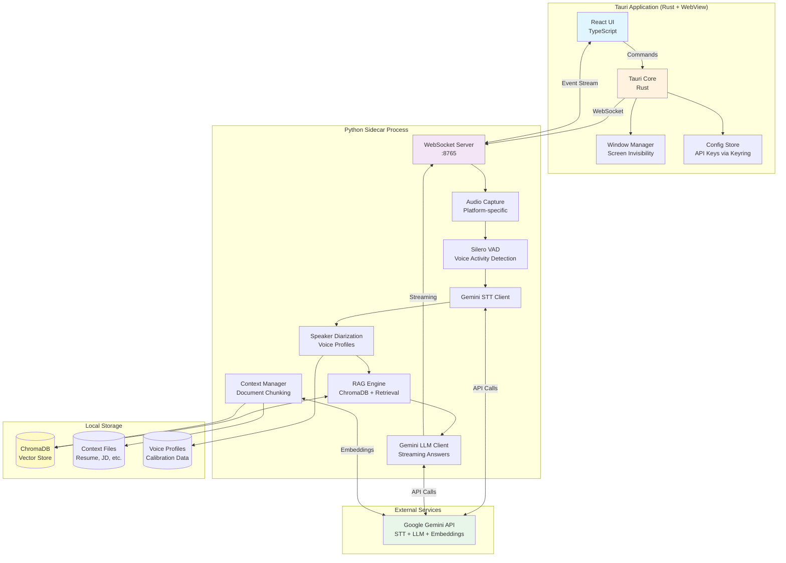

# Live Interview Agent

A cross-platform desktop application that provides real-time AI assistance during job interviews. This tool leverages a sidecar architecture combining a robust Tauri (Rust) backend with a powerful Python AI engine to deliver real-time speech-to-text, context-aware answers, and seamless OS integration.

## Key Features

- **Real-time Audio Capture & Transcription**: Utilizes Gemini STT for low-latency, high-accuracy speech recognition.
- **Speaker Diarization**: Intelligently distinguishes between the User and the Interviewer to track conversation flow.
- **Context-Aware Assistance**: Generates relevant answers using RAG (ChromaDB) and the Gemini LLM, grounded in your provided context (resumes, job descriptions).
- **Stealth Mode**: Designed to be invisible during screen shares while remaining accessible to the user.
- **Noise Reduction**: Advanced audio processing to ensure clear input in various environments.
- **Cross-Platform**: Fully supported on Windows, macOS, and Linux.

## Getting Started

### Prerequisites

Ensure you have the following installed on your system:

- **Node.js**: v20 or higher
- **Rust**: v1.75 or higher
- **Python**: v3.11 or higher
- **OS-Specific Build Tools**:
  - *Windows*: Visual Studio C++ Build Tools
  - *macOS*: Xcode Command Line Tools
  - *Linux*: `build-essential`, `libwebkit2gtk-4.0-dev`, `libssl-dev`, `libgtk-3-dev`, `libayatana-appindicator3-dev`, `librsvg2-dev`

### Installation

1.  **Clone the repository**:
    ```bash
    git clone https://github.com/yourusername/live_interview_agent.git
    cd live_interview_agent
    ```

2.  **Install Frontend Dependencies**:
    ```bash
    npm install
    ```

3.  **Install Rust Dependencies**:
    Rust dependencies are automatically handled by Cargo when you build or run the app.
    ```bash
    # Verify Rust installation
    rustc --version
    ```

4.  **Install Python Sidecar Dependencies**:
    ```bash
    cd sidecar
    # Create a virtual environment (recommended)
    python -m venv venv
    
    # Activate virtual environment
    # Windows:
    venv\Scripts\activate
    # macOS/Linux:
    source venv/bin/activate

    # Install requirements
    pip install -r requirements.txt
    cd ..
    ```

### Running the Application

To start the application in development mode (with hot-reloading for the UI):

```bash
npm run tauri dev
```

To build the application for production:

```bash
npm run tauri build
```

## Architecture

The Live Interview Agent employs a **sidecar pattern** where a Tauri application (Rust backend + WebView frontend) manages the UI and OS-level features, while a dedicated Python process handles heavy lifting for audio processing and AI interactions.



## Development

### Project Structure

- **`src/`**: React frontend application (UI, State Management).
- **`src-tauri/`**: Rust backend (OS integration, Window management, Sidecar orchestration).
- **`sidecar/`**: Python application (Audio capture, STT, RAG, LLM integration).
- **`_prism/`**: SDLC documentation and project artifacts.

### Testing

We maintain high code quality through rigorous testing across all layers:

- **Frontend (UI)**:
  ```bash
  npm run test
  ```
- **Backend (Rust)**:
  ```bash
  cd src-tauri && cargo test
  ```
- **AI Engine (Python)**:
  ```bash
  cd sidecar && pytest
  ```

## License

This project is licensed under the MIT License - see the [LICENSE](LICENSE) file for details.
