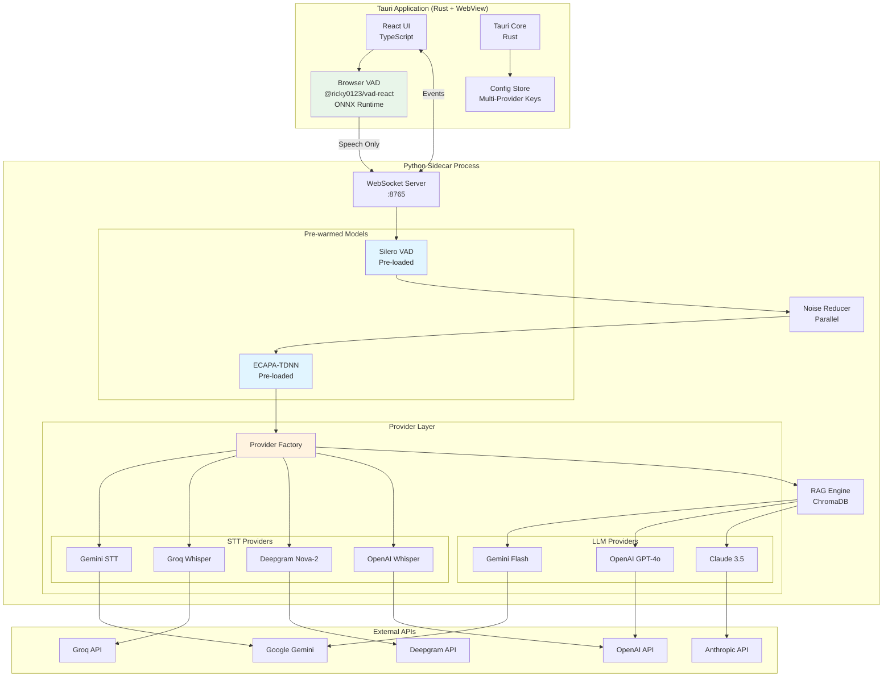

# Architecture: Live Interview Agent - Phase 2 Optimizations

## Overview

Phase 2 introduces three major architectural changes to the Live Interview Agent:

1. **Provider Abstraction Layer**: Decouples STT/LLM/Embedding logic from Gemini, enabling multi-provider support
2. **Browser-side VAD Pre-filter**: Adds ONNX-based VAD in the React UI to filter silence before WebSocket transmission
3. **Model Pre-warming**: Loads ML models at app startup instead of session start

**Key Architectural Decisions:**
1. **Provider Pattern**: Abstract factory with interface-based providers
2. **Dual VAD Strategy**: Browser VAD (pre-filter) + Python VAD (confirmation)
3. **Lazy API Initialization**: Provider clients created on-demand, models pre-loaded

## Architecture Diagram (Phase 2)



## New Components

### 1. Browser VAD Module (Frontend)

**Location**: `src/ui/hooks/useVADFilter.ts`

**Responsibility**: Filter silence in browser before WebSocket transmission

**Implementation**:
```typescript
// useVADFilter.ts
import { useMicVAD } from "@ricky0123/vad-react"

interface VADFilterOptions {
  onSpeechStart: () => void
  onSpeechEnd: (audio: Float32Array) => void
  onSpeechFrame?: (probability: number) => void
}

export const useVADFilter = (options: VADFilterOptions) => {
  const vad = useMicVAD({
    startOnLoad: false,
    baseAssetPath: "/assets/vad/",
    onSpeechStart: options.onSpeechStart,
    onSpeechEnd: options.onSpeechEnd,
    onFrameProcessed: (probs) => {
      options.onSpeechFrame?.(probs.isSpeech)
    }
  })
  
  return {
    start: vad.start,
    stop: vad.pause,
    isListening: vad.listening,
    isSpeaking: vad.userSpeaking,
    isLoading: vad.loading
  }
}
```

**Dependencies**: 
- `@ricky0123/vad-react`
- `onnxruntime-web`

**Tauri Configuration Required**:
```json
// tauri.conf.json - CSP update
{
  "tauri": {
    "security": {
      "csp": "default-src 'self'; script-src 'self' 'wasm-eval'; worker-src 'self' blob:"
    }
  }
}
```

---

### 2. Provider Abstraction Layer (Backend)

**Location**: `sidecar/src/providers/`

**Structure**:
```
sidecar/src/providers/
├── __init__.py
├── base.py              # Abstract interfaces
├── factory.py           # Provider factory
├── config.py            # Provider configuration
├── stt/
│   ├── __init__.py
│   ├── gemini.py        # GeminiSTTProvider
│   ├── groq.py          # GroqSTTProvider
│   ├── deepgram.py      # DeepgramSTTProvider
│   └── openai.py        # OpenAISTTProvider
├── llm/
│   ├── __init__.py
│   ├── gemini.py        # GeminiLLMProvider
│   ├── openai.py        # OpenAILLMProvider
│   └── anthropic.py     # AnthropicLLMProvider
└── embeddings/
    ├── __init__.py
    └── gemini.py        # GeminiEmbeddingProvider (unchanged for now)
```

#### 2.1 Base Interfaces

**File**: `sidecar/src/providers/base.py`

```python
from abc import ABC, abstractmethod
from typing import AsyncGenerator, List, Optional
from dataclasses import dataclass
from enum import Enum

class ProviderType(Enum):
    GEMINI = "gemini"
    GROQ = "groq"
    DEEPGRAM = "deepgram"
    OPENAI = "openai"
    ANTHROPIC = "anthropic"

@dataclass
class STTResult:
    text: str
    confidence: float = 1.0
    language: Optional[str] = None

class STTProvider(ABC):
    """Abstract base class for Speech-to-Text providers."""
    
    provider_type: ProviderType
    
    @abstractmethod
    async def transcribe(self, audio_bytes: bytes) -> STTResult:
        """
        Transcribe audio to text.
        
        Args:
            audio_bytes: Raw 16kHz mono 16-bit PCM audio
            
        Returns:
            STTResult with transcribed text and confidence
        """
        pass
    
    @abstractmethod
    def is_available(self) -> bool:
        """Check if provider is configured and available."""
        pass

class LLMProvider(ABC):
    """Abstract base class for LLM providers."""
    
    provider_type: ProviderType
    
    @abstractmethod
    async def generate_answer(
        self, 
        question: str, 
        context_chunks: List[str]
    ) -> AsyncGenerator[str, None]:
        """
        Generate streaming answer for question with context.
        
        Args:
            question: The interview question
            context_chunks: Retrieved context from RAG
            
        Yields:
            Answer text chunks as they're generated
        """
        pass
    
    @abstractmethod
    def is_available(self) -> bool:
        """Check if provider is configured and available."""
        pass

class EmbeddingProvider(ABC):
    """Abstract base class for embedding providers."""
    
    provider_type: ProviderType
    
    @abstractmethod
    def embed_documents(self, texts: List[str]) -> List[List[float]]:
        """Generate embeddings for documents."""
        pass
    
    @abstractmethod
    def embed_query(self, text: str) -> List[float]:
        """Generate embedding for a query."""
        pass
```

#### 2.2 Provider Factory

**File**: `sidecar/src/providers/factory.py`

```python
import logging
from typing import Dict, Optional, List
from .base import STTProvider, LLMProvider, EmbeddingProvider, ProviderType
from .config import ProviderConfig

logger = logging.getLogger(__name__)

class ProviderFactory:
    """Factory for creating and managing AI providers."""
    
    def __init__(self, config: ProviderConfig):
        self.config = config
        self._stt_providers: Dict[ProviderType, STTProvider] = {}
        self._llm_providers: Dict[ProviderType, LLMProvider] = {}
        self._embedding_provider: Optional[EmbeddingProvider] = None
        
    def get_stt_provider(
        self, 
        preferred: Optional[ProviderType] = None
    ) -> STTProvider:
        """
        Get STT provider, with fallback chain.
        
        Args:
            preferred: Preferred provider type (uses config default if None)
            
        Returns:
            Available STT provider
            
        Raises:
            RuntimeError: If no providers available
        """
        order = self._get_stt_fallback_order(preferred)
        
        for provider_type in order:
            if provider_type not in self._stt_providers:
                self._stt_providers[provider_type] = self._create_stt_provider(provider_type)
            
            provider = self._stt_providers[provider_type]
            if provider and provider.is_available():
                return provider
                
        raise RuntimeError("No STT providers available")
    
    def get_llm_provider(
        self, 
        preferred: Optional[ProviderType] = None
    ) -> LLMProvider:
        """Get LLM provider, with fallback chain."""
        order = self._get_llm_fallback_order(preferred)
        
        for provider_type in order:
            if provider_type not in self._llm_providers:
                self._llm_providers[provider_type] = self._create_llm_provider(provider_type)
            
            provider = self._llm_providers[provider_type]
            if provider and provider.is_available():
                return provider
                
        raise RuntimeError("No LLM providers available")
    
    def _get_stt_fallback_order(self, preferred: Optional[ProviderType]) -> List[ProviderType]:
        """Default: Groq -> Deepgram -> OpenAI -> Gemini"""
        default_order = [
            ProviderType.GROQ,
            ProviderType.DEEPGRAM, 
            ProviderType.OPENAI,
            ProviderType.GEMINI
        ]
        if preferred:
            return [preferred] + [p for p in default_order if p != preferred]
        return default_order
    
    def _get_llm_fallback_order(self, preferred: Optional[ProviderType]) -> List[ProviderType]:
        """Default: OpenAI -> Anthropic -> Gemini"""
        default_order = [
            ProviderType.OPENAI,
            ProviderType.ANTHROPIC,
            ProviderType.GEMINI
        ]
        if preferred:
            return [preferred] + [p for p in default_order if p != preferred]
        return default_order
    
    def _create_stt_provider(self, provider_type: ProviderType) -> Optional[STTProvider]:
        """Create STT provider instance."""
        from .stt.gemini import GeminiSTTProvider
        from .stt.groq import GroqSTTProvider
        from .stt.deepgram import DeepgramSTTProvider
        from .stt.openai import OpenAISTTProvider
        
        creators = {
            ProviderType.GEMINI: lambda: GeminiSTTProvider(self.config.gemini_api_key),
            ProviderType.GROQ: lambda: GroqSTTProvider(self.config.groq_api_key),
            ProviderType.DEEPGRAM: lambda: DeepgramSTTProvider(self.config.deepgram_api_key),
            ProviderType.OPENAI: lambda: OpenAISTTProvider(self.config.openai_api_key),
        }
        
        creator = creators.get(provider_type)
        if creator:
            try:
                return creator()
            except Exception as e:
                logger.warning(f"Failed to create {provider_type} STT provider: {e}")
        return None
    
    def _create_llm_provider(self, provider_type: ProviderType) -> Optional[LLMProvider]:
        """Create LLM provider instance."""
        from .llm.gemini import GeminiLLMProvider
        from .llm.openai import OpenAILLMProvider
        from .llm.anthropic import AnthropicLLMProvider
        
        creators = {
            ProviderType.GEMINI: lambda: GeminiLLMProvider(self.config.gemini_api_key),
            ProviderType.OPENAI: lambda: OpenAILLMProvider(self.config.openai_api_key),
            ProviderType.ANTHROPIC: lambda: AnthropicLLMProvider(self.config.anthropic_api_key),
        }
        
        creator = creators.get(provider_type)
        if creator:
            try:
                return creator()
            except Exception as e:
                logger.warning(f"Failed to create {provider_type} LLM provider: {e}")
        return None
```

#### 2.3 Provider Configuration

**File**: `sidecar/src/providers/config.py`

```python
from dataclasses import dataclass
from typing import Optional
from .base import ProviderType

@dataclass
class ProviderConfig:
    """Configuration for all AI providers."""
    
    # API Keys
    gemini_api_key: Optional[str] = None
    groq_api_key: Optional[str] = None
    deepgram_api_key: Optional[str] = None
    openai_api_key: Optional[str] = None
    anthropic_api_key: Optional[str] = None
    
    # Preferences
    preferred_stt: Optional[ProviderType] = None
    preferred_llm: Optional[ProviderType] = None
    
    # Fallback settings
    fallback_enabled: bool = True
    fallback_timeout: float = 5.0  # seconds
    
    @classmethod
    def from_dict(cls, data: dict) -> "ProviderConfig":
        """Create config from dictionary (e.g., from WebSocket message)."""
        api_keys = data.get("apiKeys", {})
        preferences = data.get("preferences", {})
        
        preferred_stt = None
        if preferences.get("sttProvider") and preferences["sttProvider"] != "auto":
            preferred_stt = ProviderType(preferences["sttProvider"])
            
        preferred_llm = None
        if preferences.get("llmProvider") and preferences["llmProvider"] != "auto":
            preferred_llm = ProviderType(preferences["llmProvider"])
        
        return cls(
            gemini_api_key=api_keys.get("gemini"),
            groq_api_key=api_keys.get("groq"),
            deepgram_api_key=api_keys.get("deepgram"),
            openai_api_key=api_keys.get("openai"),
            anthropic_api_key=api_keys.get("anthropic"),
            preferred_stt=preferred_stt,
            preferred_llm=preferred_llm,
        )
```

---

### 3. Model Pre-warming Module

**Location**: `sidecar/src/warmup.py`

**Responsibility**: Load ML models at app startup

```python
import logging
import threading
from typing import Optional
from dataclasses import dataclass, field

logger = logging.getLogger(__name__)

@dataclass
class PrewarmedModels:
    """Container for pre-warmed ML models."""
    vad_processor: Optional[object] = field(default=None, repr=False)
    speaker_recognizer: Optional[object] = field(default=None, repr=False)
    is_ready: bool = False
    error: Optional[str] = None

class ModelWarmer:
    """Pre-warms ML models in background thread."""
    
    _instance: Optional["ModelWarmer"] = None
    _models: PrewarmedModels = None
    _lock = threading.Lock()
    
    def __new__(cls):
        if cls._instance is None:
            cls._instance = super().__new__(cls)
            cls._models = PrewarmedModels()
        return cls._instance
    
    @classmethod
    def get_instance(cls) -> "ModelWarmer":
        if cls._instance is None:
            cls._instance = cls()
        return cls._instance
    
    @classmethod
    def get_models(cls) -> PrewarmedModels:
        if cls._models is None:
            cls._models = PrewarmedModels()
        return cls._models
    
    def start_warming(self) -> None:
        """Start pre-warming models in background thread."""
        thread = threading.Thread(target=self._warm_models, daemon=True)
        thread.start()
        logger.info("Model pre-warming started in background")
    
    def _warm_models(self) -> None:
        """Load all ML models."""
        try:
            # Import here to avoid blocking main thread
            from audio.vad import VADProcessor
            from audio.diarization import SpeakerRecognizer
            
            with self._lock:
                logger.info("Loading Silero VAD model...")
                self._models.vad_processor = VADProcessor()
                
                logger.info("Loading ECAPA-TDNN model...")
                self._models.speaker_recognizer = SpeakerRecognizer()
                
                self._models.is_ready = True
                logger.info("All models pre-warmed successfully")
                
        except Exception as e:
            logger.error(f"Model pre-warming failed: {e}")
            self._models.error = str(e)
    
    def wait_for_ready(self, timeout: float = 30.0) -> bool:
        """Wait for models to be ready."""
        import time
        start = time.time()
        while time.time() - start < timeout:
            if self._models.is_ready:
                return True
            if self._models.error:
                return False
            time.sleep(0.1)
        return False
```

---

## Modified Components

### 1. Server.py Changes

**Key Modifications**:

| Location | Change |
|----------|--------|
| Lines 80-90 | Replace direct provider types with base interfaces |
| Lines 222-246 | Use ProviderFactory instead of direct instantiation |
| Lines 510-520 | Use pre-warmed models from ModelWarmer |
| New | Add provider config to START_SESSION message handling |

### 2. Protocol.py Changes

**New Message Fields**:

```python
# START_SESSION now includes provider config
{
    "type": "START_SESSION",
    "data": {
        "apiKeys": {
            "gemini": "...",
            "groq": "...",
            "deepgram": "...",
            "openai": "...",
            "anthropic": "..."
        },
        "preferences": {
            "sttProvider": "groq",  # or "auto" for fallback chain
            "llmProvider": "openai"  # or "auto" for fallback chain
        }
    }
}

# New message type for provider status
{
    "type": "PROVIDER_STATUS",
    "data": {
        "stt": {"active": "groq", "available": ["groq", "gemini"]},
        "llm": {"active": "openai", "available": ["openai", "anthropic", "gemini"]}
    }
}
```

### 3. Settings UI Changes

**New Components**:
- `src/ui/components/ProviderSettings.tsx` - Provider selection UI
- Update `sessionStore.ts` with provider preferences

---

## Data Flow (Phase 2)

```
+-------------------------------------------------------------------------+
|                              AUDIO FLOW                                  |
+-------------------------------------------------------------------------+
|                                                                          |
|  [Microphone] --> [Browser VAD] --> [WebSocket] --> [Python VAD]        |
|                    (ONNX, ~5ms)      (speech only)   (confirmation)      |
|                         |                                 |              |
|                         | (silence filtered)              v              |
|                         v                          [NoiseReducer]        |
|                   CPU: <2%                         (parallel, ~20ms)     |
|                                                           |              |
|                                                           v              |
|                                                    [STT Provider]        |
|                                                    (Groq: ~300ms)        |
|                                                           |              |
|                                                           v              |
|                                                    [Diarization]         |
|                                                    (pre-warmed, ~50ms)   |
|                                                           |              |
|                    +--------------------------------------+              |
|                    v                                                     |
|              [If Interviewer]                                            |
|                    |                                                     |
|                    v                                                     |
|              [RAG Retrieval] --> [LLM Provider] --> [WebSocket] --> [UI]|
|              (~100ms)            (streaming)        (chunks)             |
|                                                                          |
+-------------------------------------------------------------------------+

Estimated Latency (Phase 2):
  Browser VAD:     ~5ms
  WebSocket IPC:   ~10ms
  Python VAD:      ~15ms (confirmation only)
  Noise Reduction: ~20ms (parallel with VAD)
  STT (Groq):      ~300ms
  Diarization:     ~50ms (pre-warmed)
  RAG:             ~100ms
  LLM:             ~1000ms
  -----------------------
  Total:           ~1.5s (down from ~1.85s)
```

---

## Build Sequence (Phase 2 Stories)

| ID | Story | Priority | Effort | Dependencies | Deliverable |
|----|-------|----------|--------|--------------|-------------|
| STORY-021 | Model Pre-warming Infrastructure | High | 1 day | None | `warmup.py` module, models load at startup |
| STORY-022 | Provider Base Interfaces | High | 0.5 days | None | `providers/base.py` with STTProvider, LLMProvider |
| STORY-023 | Provider Factory | High | 1 day | STORY-022 | `providers/factory.py` with fallback logic |
| STORY-024 | Refactor Gemini STT to Provider | High | 0.5 days | STORY-022 | `providers/stt/gemini.py` |
| STORY-025 | Refactor Gemini LLM to Provider | High | 0.5 days | STORY-022 | `providers/llm/gemini.py` |
| STORY-026 | Groq STT Provider | High | 1 day | STORY-023 | `providers/stt/groq.py` |
| STORY-027 | Deepgram STT Provider | Medium | 1 day | STORY-023 | `providers/stt/deepgram.py` |
| STORY-028 | OpenAI Whisper STT Provider | Medium | 0.5 days | STORY-023 | `providers/stt/openai.py` |
| STORY-029 | OpenAI LLM Provider | High | 1 day | STORY-023 | `providers/llm/openai.py` |
| STORY-030 | Anthropic LLM Provider | Medium | 1 day | STORY-023 | `providers/llm/anthropic.py` |
| STORY-031 | Browser VAD Integration | High | 2 days | None | `useVADFilter.ts`, Tauri CSP config |
| STORY-032 | Provider Configuration UI | Medium | 1 day | STORY-023-030 | `ProviderSettings.tsx`, multi-key storage |
| STORY-033 | Server Integration + Testing | High | 1 day | All above | Updated `server.py`, E2E tests |

---

## Trade-offs

| Decision | Alternative | Rationale |
|----------|-------------|-----------|
| **Dual VAD (Browser + Python)** | Python VAD only | Browser VAD reduces WebSocket traffic by 60%+. Python VAD confirms to maintain accuracy. Small CPU overhead (~2%) acceptable. |
| **Provider Factory Pattern** | Direct instantiation | Factory enables fallback chains, lazy initialization, and future provider additions without modifying server code. |
| **Pre-warming at startup** | Lazy loading | Eliminates 2-5s delay at session start. ~1s startup cost is acceptable trade-off. |
| **Groq as default STT** | Gemini first | Groq Whisper is faster (~300ms vs ~500ms) and has higher rate limits (30/min vs 15/min). |
| **OpenAI as default LLM** | Gemini first | GPT-4o has broader model knowledge and better instruction following. User can override. |

---

## Risks and Mitigations

| Risk | Impact | Probability | Mitigation |
|------|--------|-------------|------------|
| Browser VAD WASM loading fails | Medium | Low | Fallback to Python-only VAD, log warning |
| Provider API key misconfiguration | Medium | Medium | Clear error messages, validation on save |
| Fallback chain exhausted | High | Low | Always keep Gemini as final fallback, display error UI |
| Model pre-warming timeout | Medium | Low | Fallback to lazy loading with user notification |
| Anthropic prompt format issues | Low | Medium | Test extensively, use same template structure |

---

## File Structure (Phase 2 Additions)

```
live_interview_agent/
├── src/
│   └── ui/
│       ├── hooks/
│       │   └── useVADFilter.ts          # NEW: Browser VAD hook
│       └── components/
│           └── ProviderSettings.tsx      # NEW: Provider config UI
├── public/
│   └── assets/
│       └── vad/                          # NEW: ONNX model files
│           ├── silero_vad.onnx
│           └── ort-wasm*.wasm
├── sidecar/
│   └── src/
│       ├── warmup.py                     # NEW: Model pre-warming
│       └── providers/                    # NEW: Provider abstraction
│           ├── __init__.py
│           ├── base.py
│           ├── factory.py
│           ├── config.py
│           ├── stt/
│           │   ├── __init__.py
│           │   ├── gemini.py
│           │   ├── groq.py
│           │   ├── deepgram.py
│           │   └── openai.py
│           └── llm/
│               ├── __init__.py
│               ├── gemini.py
│               ├── openai.py
│               └── anthropic.py
└── _prism/
    ├── planning/
    │   └── prd-phase2.md                 # NEW: Phase 2 PRD
    └── architecture/
        └── architecture-phase2.md        # NEW: This file
```

---

**Document Status**: Approved
**Created**: 2026-01-06
**Last Updated**: 2026-01-06
**Owner**: Architecture (AI Agent)
**Approved By**: User

**Next Step**: Create implementation stories and begin STORY-021.
