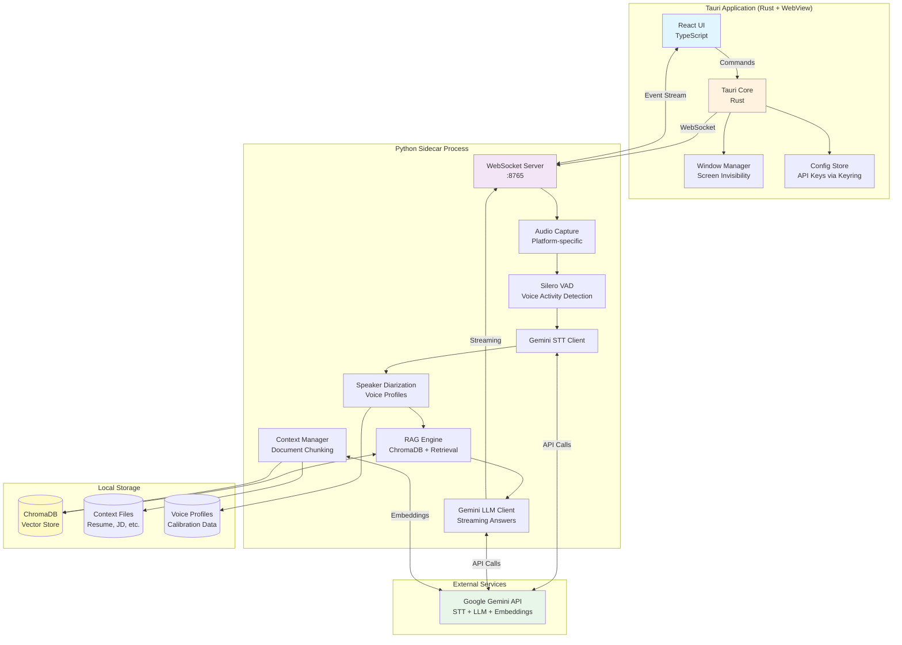

# Architecture: Live Interview Agent

## Overview

The Live Interview Agent is a cross-platform desktop application that provides real-time AI assistance during job interviews. The architecture employs a **sidecar pattern** where a Tauri application (Rust backend + WebView frontend) manages the UI and OS-level features, while a Python sidecar process handles audio processing, speech-to-text, RAG retrieval, and LLM generation.

**Key Architectural Decisions:**
1. **Sidecar Architecture**: Tauri (Rust + TypeScript) + Python sidecar process
2. **IPC Mechanism**: WebSocket (localhost) for bidirectional streaming communication
3. **Audio Capture**: Platform-specific native APIs (WASAPI/Core Audio/PulseAudio)
4. **Vector DB**: ChromaDB (persistent, Python-native)
5. **VAD**: Silero VAD (PyTorch-based, runs in Python sidecar)
6. **Embeddings**: Gemini Embeddings API
7. **Screen Invisibility**: OS-specific window flags via Tauri window extensions

## Architecture Diagram



## Technology Stack

### Frontend (Tauri WebView)
- **Framework**: React 18.3+ with TypeScript 5.3+
- **UI Library**: Tailwind CSS 3.4+ for styling
- **State Management**: Zustand 4.5+ (lightweight, simple)
- **WebSocket Client**: Native WebSocket API
- **Build Tool**: Vite 5.0+

**Rationale**: React provides component reusability, TypeScript ensures type safety, Tailwind enables rapid UI development. Zustand is simpler than Redux for this use case.

### Backend (Tauri Core - Rust)
- **Framework**: Tauri 1.5+
- **Rust Version**: 1.75+ (2021 edition)
- **Keyring**: keyring 2.2+ (cross-platform secure storage)
- **Process Management**: tokio 1.35+ (async runtime), subprocess 0.2+
- **Window API**: tauri::window for screen invisibility flags

**Rationale**: Tauri provides small bundle size (<10MB), native OS APIs, and secure IPC. Rust ensures memory safety and performance.

### Sidecar (Python Process)
- **Python Version**: 3.11+ (better performance, improved asyncio)
- **Web Framework**: websockets 12.0+ (async WebSocket server)
- **Audio Capture**:
  - Windows: pyaudiowpatch 0.2.12.7+ (WASAPI loopback)
  - macOS: sounddevice 0.4.6+ (Core Audio)
  - Linux: sounddevice 0.4.6+ (PulseAudio/ALSA)
- **VAD**: silero-vad 4.0+ (PyTorch-based)
- **STT/LLM Client**: google-generativeai 0.3.2+
- **Vector DB**: chromadb 0.4.22+
- **Embeddings**: google-generativeai (Gemini Embeddings API)
- **Document Processing**: pypdf 3.17+, python-docx 1.1.0+, beautifulsoup4 4.12+
- **Audio Processing**: numpy 1.26+, scipy 1.11+, noisereduce 3.0+ (noise reduction)

**Rationale**: Python ecosystem has mature libraries for audio/ML. ChromaDB is Python-native. Silero VAD is state-of-the-art for voice activity detection.

### Distribution
- **Packaging**: PyInstaller 6.3+ (bundle Python sidecar into single executable)
- **Installer**: Tauri bundler (creates platform-specific installers: MSI, DMG, AppImage)
- **Final Artifact**: Single executable with embedded Python runtime + dependencies

**Rationale**: PyInstaller bundles Python dependencies into the sidecar. Tauri bundler creates native installers for each OS.

## Components

### 1. Tauri Application (Rust + WebView)

#### 1.1 React UI (TypeScript)
- **Responsibility**: User interface, state management, user interactions
- **Location**: `src/ui/`
- **Key Files**:
  - `src/ui/App.tsx` - Main application component
  - `src/ui/components/SessionControls.tsx` - Start/Stop buttons
  - `src/ui/components/AnswerDisplay.tsx` - Streaming answer renderer
  - `src/ui/components/ContextLoader.tsx` - File upload interface
  - `src/ui/components/CalibrationModal.tsx` - Voice calibration UI
  - `src/ui/store/sessionStore.ts` - Zustand store for session state
- **Interface**:
  - WebSocket connection to Python sidecar (localhost:8765)
  - Tauri commands via `@tauri-apps/api`
- **Dependencies**: None (top-level component)

#### 1.2 Tauri Core (Rust)
- **Responsibility**: OS integration, window management, secure storage, sidecar lifecycle
- **Location**: `src-tauri/src/`
- **Key Files**:
  - `src-tauri/src/main.rs` - Entry point, window setup
  - `src-tauri/src/commands/` - Tauri command handlers
    - `config.rs` - API key management (keyring integration)
    - `window.rs` - Screen invisibility toggle
    - `sidecar.rs` - Python sidecar lifecycle management
  - `src-tauri/src/utils/` - Helper utilities
    - `keyring.rs` - Secure API key storage/retrieval
    - `platform.rs` - Platform-specific window flags
- **Interface**:
  - Tauri Commands (invoked from UI):
    - `get_api_key() -> Result<String, String>`
    - `set_api_key(key: String) -> Result<(), String>`
    - `toggle_screen_invisibility(enabled: bool) -> Result<(), String>`
    - `start_sidecar() -> Result<(), String>`
    - `stop_sidecar() -> Result<(), String>`
- **Dependencies**: Python sidecar (subprocess)

#### 1.3 Window Manager (Screen Invisibility)
- **Responsibility**: Apply OS-specific flags to exclude window from screen capture
- **Location**: `src-tauri/src/utils/platform.rs`
- **Implementation**:
  - **Windows**: `SetWindowDisplayAffinity(WDA_EXCLUDEFROMCAPTURE)` via windows-rs
  - **macOS**: `NSWindow.sharingType = .none` via objc bindings
  - **Linux**: `_NET_WM_BYPASS_COMPOSITOR` property + Wayland protocol extension
- **Interface**:
  - `apply_screen_invisibility(window: &Window) -> Result<(), String>`
- **Dependencies**: Platform-specific window APIs

#### 1.4 Config Store (API Keys)
- **Responsibility**: Securely store and retrieve Gemini API key
- **Location**: `src-tauri/src/utils/keyring.rs`
- **Implementation**:
  - **Windows**: Windows Credential Manager (`keyring` crate)
  - **macOS**: macOS Keychain (`keyring` crate)
  - **Linux**: Secret Service API (`keyring` crate)
- **Interface**:
  - `store_api_key(key: &str) -> Result<(), String>`
  - `retrieve_api_key() -> Result<String, String>`
  - `delete_api_key() -> Result<(), String>`
- **Dependencies**: `keyring` crate

### 2. Python Sidecar Process

#### 2.1 WebSocket Server
- **Responsibility**: Bidirectional communication with Tauri UI, event routing
- **Location**: `sidecar/src/server.py`
- **Implementation**:
  - Async WebSocket server on localhost:8765
  - Message types: `START_SESSION`, `STOP_SESSION`, `UPLOAD_CONTEXT`, `CALIBRATE_VOICE`, `MANUAL_QUESTION`, `ANSWER_STREAM`, `ERROR`
  - JSON message protocol with type discriminators
- **Interface**:
  - Message Protocol (JSON over WebSocket):
    ```json
    // Client -> Server
    {"type": "START_SESSION", "apiKey": "..."}
    {"type": "STOP_SESSION"}
    {"type": "UPLOAD_CONTEXT", "files": [...]}
    {"type": "CALIBRATE_VOICE", "audioData": "base64..."}
    {"type": "MANUAL_QUESTION", "question": "..."}

    // Server -> Client
    {"type": "TRANSCRIPTION", "speaker": "Interviewer", "text": "..."}
    {"type": "ANSWER_CHUNK", "chunk": "...", "complete": false}
    {"type": "ANSWER_CHUNK", "chunk": "...", "complete": true, "confidence": "high"}
    {"type": "ERROR", "message": "..."}
    {"type": "STATUS", "state": "listening|processing|idle"}
    ```
- **Dependencies**: All other sidecar components

#### 2.2 Audio Capture Module
- **Responsibility**: Capture system audio (loopback/monitor device) in real-time
- **Location**: `sidecar/src/audio/capture.py`
- **Implementation**:
  - **Windows**: `pyaudiowpatch` - WASAPI loopback capture
  - **macOS**: `sounddevice` - Core Audio aggregate device (requires manual setup in Audio MIDI Setup)
  - **Linux**: `sounddevice` - PulseAudio monitor source
  - 16kHz mono, 16-bit PCM
  - Circular buffer (5-second capacity) to handle processing delays
- **Interface**:
  - `class AudioCapture`:
    - `start_capture() -> None` - Begin capturing to buffer
    - `stop_capture() -> None` - Stop and clear buffer
    - `get_audio_stream() -> AsyncIterator[bytes]` - Yield audio chunks (500ms each)
- **Dependencies**: VAD module (downstream)

#### 2.3 Silero VAD Module
- **Responsibility**: Voice Activity Detection - detect speech segments, filter silence
- **Location**: `sidecar/src/audio/vad.py`
- **Implementation**:
  - Silero VAD v4 model (PyTorch)
  - Sliding window: 512 samples (32ms at 16kHz)
  - Threshold: 0.5 probability
  - Smoothing: Require 3 consecutive frames for speech start/end
  - Output: Speech segments with timestamps
- **Interface**:
  - `class SileroVAD`:
    - `process_audio(audio: bytes) -> List[SpeechSegment]`
    - `SpeechSegment`: `{start_time: float, end_time: float, audio_data: bytes}`
- **Dependencies**: STT module (downstream)

#### 2.4 Speaker Diarization Module
- **Responsibility**: Classify speech as "User" or "Interviewer" based on voice calibration
- **Location**: `sidecar/src/audio/diarization.py`
- **Implementation**:
  - Voice embedding using speechbrain/spkrec-ecapa-voxceleb (local ECAPA-TDNN model)
  - Calibration: Extract speaker embedding from 5-10s user voice sample
  - Comparison: Cosine similarity between calibration embedding and incoming speech
  - Threshold: >0.75 similarity = User, <0.75 = Interviewer
- **Interface**:
  - `class SpeakerDiarizer`:
    - `calibrate(audio: bytes) -> VoiceProfile` - Create user voice profile
    - `classify_speaker(audio: bytes, profile: VoiceProfile) -> str` - Returns "User" or "Interviewer"
    - `save_profile(profile: VoiceProfile, path: str) -> None`
    - `load_profile(path: str) -> VoiceProfile`
- **Dependencies**: STT module (provides speaker labels)

#### 2.5 Gemini STT Client
- **Responsibility**: Transcribe speech segments to text using Gemini STT API
- **Location**: `sidecar/src/stt/gemini_stt.py`
- **Implementation**:
  - Google Generative AI SDK (`google-generativeai`)
  - Model: `gemini-1.5-flash` (STT support)
  - Input: Audio bytes (16kHz mono PCM or WAV)
  - Batching: Process 5-second segments
  - Retry logic: Exponential backoff (3 attempts)
- **Interface**:
  - `class GeminiSTT`:
    - `transcribe(audio: bytes, speaker: str) -> Transcription`
    - `Transcription`: `{text: str, speaker: str, timestamp: float, confidence: float}`
- **Dependencies**: RAG Engine (downstream)

#### 2.6 Context Manager
- **Responsibility**: Parse, chunk, and embed user-uploaded context documents
- **Location**: `sidecar/src/context/manager.py`
- **Implementation**:
  - Document parsing:
    - PDF: `pypdf` (extract text, handle multi-column with layout analysis)
    - DOCX: `python-docx`
    - TXT/MD: Direct read
    - URL: `beautifulsoup4` (extract main content, strip navigation)
  - Chunking strategy:
    - Fixed-size: 500 tokens per chunk
    - Overlap: 50 tokens
    - Metadata: `{source: filename, chunk_id: int, page: int}`
  - Embedding: Gemini Embeddings API (`text-embedding-004`)
- **Interface**:
  - `class ContextManager`:
    - `load_document(file_path: str) -> Document`
    - `chunk_document(document: Document) -> List[Chunk]`
    - `embed_chunks(chunks: List[Chunk]) -> List[EmbeddedChunk]`
    - `store_in_db(embedded_chunks: List[EmbeddedChunk]) -> None`
- **Dependencies**: ChromaDB (storage)

#### 2.7 RAG Engine
- **Responsibility**: Retrieve relevant context chunks for interviewer questions
- **Location**: `sidecar/src/rag/engine.py`
- **Implementation**:
  - Vector DB: ChromaDB (persistent storage in `~/.live_interview_agent/chroma/`)
  - Query: Embed question using Gemini Embeddings, similarity search (cosine)
  - Top-k: Retrieve 5 chunks
  - Re-ranking: Optional (future enhancement)
  - Confidence scoring:
    - High: Best match >0.8 similarity
    - Medium: Best match 0.6-0.8
    - Low: Best match <0.6
- **Interface**:
  - `class RAGEngine`:
    - `retrieve(question: str, top_k: int = 5) -> RetrievalResult`
    - `RetrievalResult`: `{chunks: List[Chunk], confidence: str, scores: List[float]}`
- **Dependencies**: LLM Client (downstream), ChromaDB

#### 2.8 Gemini LLM Client
- **Responsibility**: Generate contextual answers using retrieved context and question
- **Location**: `sidecar/src/llm/gemini_llm.py`
- **Implementation**:
  - Model: `gemini-1.5-flash` (fast, cost-effective)
  - Streaming: Word-by-word output via SSE
  - Prompt template:
    ```
    You are an interview assistant. Answer the following question using the provided context.

    Context:
    {retrieved_chunks}

    Question: {interviewer_question}

    Provide a concise, relevant answer suitable for a live interview response.
    ```
  - Temperature: 0.3 (deterministic, factual)
  - Max tokens: 300 (concise answers)
- **Interface**:
  - `class GeminiLLM`:
    - `generate_answer(question: str, context: List[Chunk]) -> AsyncIterator[str]`
    - Yields words/phrases as they're generated
- **Dependencies**: WebSocket server (sends chunks to UI)

### 3. External Services

#### 3.1 Google Gemini API
- **Services Used**:
  - STT: Audio transcription
  - LLM: Answer generation (`gemini-1.5-flash`)
  - Embeddings: `text-embedding-004` (768 dimensions)
- **Authentication**: API key (stored in OS keychain)
- **Rate Limits**:
  - STT: 60 requests/minute (free tier)
  - LLM: 15 requests/minute (free tier)
  - Embeddings: 1500 requests/minute (free tier)
- **Error Handling**: Exponential backoff, retry 3 times, fallback to error message in UI

### 4. Local Storage

#### 4.1 ChromaDB Vector Store
- **Storage Location**: `~/.live_interview_agent/chroma/`
- **Collections**:
  - `user_context` - Main collection for resume, JD, Q&A docs
- **Schema**:
  - Document ID: UUID
  - Embedding: 768-dim vector (Gemini embeddings)
  - Metadata: `{source: str, chunk_id: int, page: int, upload_timestamp: int}`
  - Document text: Full chunk text
- **Persistence**: Persistent across sessions, cleared on user request

#### 4.2 Context Files Storage
- **Storage Location**: `~/.live_interview_agent/context/`
- **Structure**:
  - Original files stored with UUID filenames
  - Mapping file: `context_map.json` - `{uuid: {original_name, upload_date, file_path}}`
- **Cleanup**: Delete on user removal or app uninstall

#### 4.3 Voice Profiles Storage
- **Storage Location**: `~/.live_interview_agent/profiles/`
- **Format**: NumPy `.npy` files (speaker embeddings)
- **Naming**: `voice_profile_{timestamp}.npy`
- **Retention**: Keep last 5 profiles, auto-delete older

## Data Model

### 1. Session State (In-Memory)

```typescript
// Zustand store in UI
interface SessionState {
  status: 'idle' | 'calibrating' | 'listening' | 'processing';
  isScreenInvisible: boolean;
  currentTranscription: Transcription | null;
  currentAnswer: Answer | null;
  answerHistory: Answer[]; // Session only
  loadedContextFiles: ContextFile[];
  voiceProfileActive: boolean;
}

interface Transcription {
  speaker: 'User' | 'Interviewer';
  text: string;
  timestamp: number;
  confidence: number;
}

interface Answer {
  question: string;
  answerText: string;
  confidence: 'high' | 'medium' | 'low';
  timestamp: number;
  isComplete: boolean;
}

interface ContextFile {
  id: string;
  name: string;
  type: 'resume' | 'job_description' | 'company_info' | 'qa';
  size: number;
  uploadDate: number;
  preview: string; // First 200 chars
}
```

### 2. WebSocket Message Protocol

```python
# Python sidecar message types
class MessageType(Enum):
    START_SESSION = "START_SESSION"
    STOP_SESSION = "STOP_SESSION"
    UPLOAD_CONTEXT = "UPLOAD_CONTEXT"
    CALIBRATE_VOICE = "CALIBRATE_VOICE"
    MANUAL_QUESTION = "MANUAL_QUESTION"
    TRANSCRIPTION = "TRANSCRIPTION"
    ANSWER_CHUNK = "ANSWER_CHUNK"
    ERROR = "ERROR"
    STATUS = "STATUS"

# Example messages
{
    "type": "TRANSCRIPTION",
    "data": {
        "speaker": "Interviewer",
        "text": "Tell me about your experience with React.",
        "timestamp": 1704123456.789,
        "confidence": 0.92
    }
}

{
    "type": "ANSWER_CHUNK",
    "data": {
        "chunk": "I have 4 years of experience with React, including...",
        "complete": false,
        "confidence": "high"
    }
}
```

### 3. ChromaDB Document Structure

```python
# Document stored in ChromaDB
{
    "id": "uuid-1234",
    "embedding": [0.123, 0.456, ...],  # 768-dim vector
    "document": "Full text of chunk...",
    "metadata": {
        "source": "resume.pdf",
        "chunk_id": 5,
        "page": 2,
        "upload_timestamp": 1704123456
    }
}
```

### 4. Voice Profile Data

```python
# Stored as NumPy array
voice_profile = {
    "embedding": np.array([...]),  # 192-dim ECAPA-TDNN embedding
    "calibration_timestamp": 1704123456,
    "sample_duration": 8.5  # seconds
}
```

## Integration Points

| Component A | Component B | Method | Purpose | Data Format |
|-------------|-------------|--------|---------|-------------|
| React UI | Tauri Core | Tauri IPC | API key management, window control | JSON (Tauri commands) |
| React UI | Python Sidecar | WebSocket (localhost:8765) | Session control, context upload, answer streaming | JSON messages |
| Tauri Core | Python Sidecar | Subprocess | Lifecycle management (start/stop) | Command-line args |
| Python Sidecar | Gemini API | HTTPS REST | STT, LLM, Embeddings | JSON (Google API format) |
| Python Sidecar | ChromaDB | Python API | Vector storage/retrieval | Native Python objects |
| Audio Capture | OS APIs | Native APIs | System audio loopback | PCM audio bytes |

## Security Considerations

### 1. API Key Storage
- **Storage**: OS-specific secure storage via `keyring` crate
  - Windows: Credential Manager (DPAPI encrypted)
  - macOS: Keychain (AES-256 encrypted)
  - Linux: Secret Service (libsecret)
- **Access**: Only Tauri backend can read/write (not accessible from WebView)
- **Transmission**: Sent to Python sidecar over localhost WebSocket (not exposed to network)

### 2. Data Privacy
- **Session Data**: Stored in memory only during active session
- **Transcripts**: Cleared on session stop, never written to disk
- **Context Files**: Stored locally, never uploaded except to Gemini API for embeddings
- **Audio**: Buffered in memory (5-second circular buffer), no recording to disk

### 3. Network Security
- **Gemini API**: All calls over HTTPS (TLS 1.3)
- **WebSocket**: Localhost only (127.0.0.1:8765), not exposed to network
- **No telemetry**: No usage data sent to external servers

### 4. Screen Invisibility
- **Purpose**: Prevent detection during screen sharing
- **Implementation**: OS-specific window flags (not foolproof, depends on capture method)
- **Fallback**: Manual minimize hotkey (Ctrl+Shift+H)

## Cross-Cutting Concerns

### 1. Error Handling
- **UI Layer**: Display user-friendly error messages, never crash
- **Sidecar Layer**: Log errors to console (development), send error messages to UI
- **API Failures**: Retry with exponential backoff (3 attempts), then show error in UI
- **Audio Failures**: Fallback to manual question input mode

### 2. Logging
- **Development**: Console logging in both Tauri and Python
- **Production**: Minimal logging (errors only), no sensitive data (transcripts, API keys)
- **Log Location**:
  - Tauri: stdout/stderr
  - Python: stdout/stderr (captured by Tauri subprocess)

### 3. Performance Optimization
- **Audio Buffer**: Circular buffer to prevent memory growth
- **ChromaDB**: Index optimization for fast similarity search (<1 second)
- **VAD**: Reduce processing during silence (CPU <5% idle)
- **Streaming**: Word-by-word LLM output to reduce perceived latency

### 4. Testing Strategy
- **Unit Tests**:
  - Rust: `cargo test` for Tauri commands
  - Python: `pytest` for each module (VAD, STT, RAG, LLM)
  - TypeScript: `vitest` for UI components
- **Integration Tests**:
  - End-to-end WebSocket message flow
  - Audio pipeline (mock audio input → transcription)
  - RAG retrieval accuracy
- **Manual Tests**:
  - Screen invisibility on each OS
  - Voice calibration accuracy
  - 2-hour stability test

## Build Sequence

The following order ensures dependencies are built before dependents, and testable units are completed incrementally.

### Phase 1: Foundation (Week 1-2)
1. **Tauri Project Setup**
   - Initialize Tauri app with React + TypeScript
   - Configure build scripts and dependencies
   - Setup directory structure
   - Deliverable: `npm run tauri dev` launches empty app

2. **Python Sidecar Setup**
   - Create Python project structure (`sidecar/`)
   - Setup virtual environment and dependencies
   - Create WebSocket server skeleton
   - Deliverable: Standalone Python server runs on port 8765

3. **WebSocket Communication**
   - Implement WebSocket client in React UI
   - Implement message protocol (JSON schemas)
   - Test bidirectional messaging
   - Deliverable: UI can send/receive messages to/from sidecar

4. **Config Store (API Keys)**
   - Implement `keyring.rs` in Tauri
   - Create Tauri commands: `get_api_key`, `set_api_key`
   - Build UI settings screen for API key input
   - Deliverable: API key stored securely, retrieved on app start

### Phase 2: Audio Pipeline (Week 3-4)
5. **Audio Capture Module**
   - Implement platform-specific audio capture (Windows/macOS/Linux)
   - Create circular buffer
   - Stream audio chunks to WebSocket
   - Deliverable: Raw audio captured and sent to UI (visualize waveform)

6. **Silero VAD Integration**
   - Integrate Silero VAD model
   - Implement speech segment detection
   - Filter silence from audio stream
   - Deliverable: Only speech segments sent to downstream components

7. **Voice Calibration UI + Diarization**
   - Build calibration modal in UI
   - Implement speaker embedding (ECAPA-TDNN) in Python
   - Save/load voice profiles
   - Test speaker classification accuracy
   - Deliverable: User can calibrate voice, system labels "User" vs "Interviewer"

8. **Gemini STT Integration**
   - Implement Gemini STT client in Python
   - Connect VAD output → STT input
   - Send transcriptions to UI via WebSocket
   - Deliverable: Live transcription displayed in UI

### Phase 3: RAG + Context (Week 5-6)
9. **Context Manager**
   - Implement document parsers (PDF, DOCX, TXT, URL)
   - Build chunking logic (500 tokens, 50 token overlap)
   - Create context upload UI
   - Deliverable: Users can upload files, see preview in UI

10. **ChromaDB Setup + Embeddings**
    - Initialize ChromaDB persistent storage
    - Integrate Gemini Embeddings API
    - Implement `embed_chunks` and `store_in_db`
    - Deliverable: Uploaded documents chunked and stored in ChromaDB

11. **RAG Engine**
    - Implement similarity search in ChromaDB
    - Build query embedding → retrieval pipeline
    - Implement confidence scoring (high/medium/low)
    - Deliverable: Given question, retrieve top 5 relevant chunks

### Phase 4: LLM + Answer Generation (Week 7)
12. **Gemini LLM Integration**
    - Implement Gemini LLM client with streaming
    - Build prompt template with context injection
    - Connect RAG retrieval → LLM generation
    - Deliverable: Answers generated with retrieved context

13. **Answer Display UI**
    - Build streaming answer display component
    - Implement word-by-word typing effect
    - Show confidence indicators (high/medium/low)
    - Deliverable: Answers stream to UI with smooth display

14. **Full Pipeline Integration**
    - Connect audio capture → VAD → STT → Diarization → RAG → LLM → UI
    - Filter out "User" speech (only process "Interviewer" questions)
    - Test end-to-end latency (<5 seconds)
    - Deliverable: Complete interview assistant workflow functional

### Phase 5: Advanced Features (Week 8)
15. **Screen Invisibility**
    - Implement platform-specific window flags (Windows/macOS/Linux)
    - Create Tauri command `toggle_screen_invisibility`
    - Add UI toggle button
    - Test on each OS with screen sharing tools
    - Deliverable: App invisible in screen shares on all platforms

16. **Session Controls**
    - Implement Start/Stop session logic
    - Clear session data on stop
    - Add manual question input fallback
    - Deliverable: Users can control session lifecycle

17. **Noise Reduction (Optional Enhancement)**
    - Integrate `noisereduce` library
    - Apply preprocessing before STT
    - Test accuracy improvement with noisy audio
    - Deliverable: Improved STT accuracy in suboptimal conditions

### Phase 6: Packaging + Distribution (Week 9)
18. **PyInstaller Sidecar Bundling**
    - Create PyInstaller spec file
    - Bundle Python sidecar into single executable
    - Configure Tauri to include sidecar in resources
    - Deliverable: Single app bundle with embedded Python runtime

19. **Platform-Specific Installers**
    - Configure Tauri bundler for Windows (MSI), macOS (DMG), Linux (AppImage)
    - Test installation on clean VMs
    - Verify app launches and functions correctly
    - Deliverable: Installer packages for all platforms

20. **End-to-End Testing**
    - 2-hour stability test (no crashes)
    - Resource usage validation (<500MB RAM, <30% CPU)
    - Latency testing (P50 <3s, P95 <5s)
    - Screen invisibility verification on all OS versions
    - Deliverable: MVP meets all NFRs

## Trade-offs and Decisions

| Decision | Alternative Considered | Rationale for Choice |
|----------|------------------------|----------------------|
| **Sidecar Architecture** | Embed Python in Rust via PyO3 | Cleaner separation of concerns. Easier to develop/debug independently. PyO3 requires complex FFI and memory management. |
| **WebSocket IPC** | stdin/stdout pipes, HTTP REST | WebSocket supports bidirectional streaming (essential for real-time transcription and answer streaming). Simpler protocol than HTTP for event-driven communication. |
| **ChromaDB** | FAISS, Qdrant, Pinecone | ChromaDB is Python-native, persistent, and simple. FAISS requires manual persistence. Qdrant/Pinecone add complexity. ChromaDB sufficient for local use (<10k chunks). |
| **Silero VAD** | WebRTC VAD, custom model | Silero VAD is state-of-the-art (>95% accuracy), open-source, and actively maintained. WebRTC VAD is older and less accurate. |
| **Gemini-only (MVP)** | Multi-provider (OpenAI, Anthropic) | Simplifies implementation and testing. Multi-provider adds complexity (different APIs, rate limits, prompt formats). Can add in Phase 2. |
| **Gemini Embeddings API** | Local embeddings (Sentence-BERT) | API is faster (<200ms) and higher quality. Local model requires GPU for speed or is slow on CPU. Acceptable API cost (<$0.05/session). |
| **Word-by-word streaming** | Sentence-by-sentence | Reduces perceived latency. User can start reading immediately. Acceptable UI complexity. |
| **Mandatory calibration** | Optional calibration | Diarization accuracy drops significantly without calibration (from 85% to ~60%). 5-10 second upfront cost is acceptable for much better UX. |
| **React + Zustand** | Svelte, Vue, Redux | React has largest ecosystem and team familiarity. Zustand is simpler than Redux for this app's state needs. Svelte/Vue are fine alternatives but no compelling advantage. |
| **PyInstaller bundling** | Ship Python separately | Single executable simplifies distribution and meets <5 minute setup goal. Separate Python requires user to install Python 3.11+, adds friction. |
| **Tauri over Electron** | Electron | Tauri has smaller bundle size (10MB vs 150MB), better performance, native OS integration, and Rust security. Electron is more mature but overkill for this app. |
| **16kHz audio** | 44.1kHz or 48kHz | Gemini STT optimized for 16kHz. Lower sample rate reduces bandwidth and processing. Human speech bandwidth is ~8kHz, so 16kHz is sufficient. |
| **Platform-specific audio APIs** | Cross-platform library (PortAudio) | Native APIs provide better loopback/monitor access. PortAudio has limited loopback support on Windows. Platform-specific code is acceptable for audio quality. |

## Risks and Mitigations

| Risk | Impact | Probability | Mitigation |
|------|--------|-------------|------------|
| **Screen invisibility fails on new OS version** | High (user detected) | Medium | Implement manual minimize hotkey as fallback. Document tested OS versions. Auto-update to apply fixes. |
| **Gemini API rate limits hit during interview** | High (tool unusable) | Low | Implement request queuing. Display "Rate limited, retrying..." message. Consider paid tier for higher limits. |
| **Audio capture permissions denied** | High (no audio input) | Medium | Clear setup instructions with screenshots. Detect permission errors and show troubleshooting UI. |
| **ChromaDB performance degrades with large context** | Medium (>1s retrieval) | Low | Enforce 50MB context limit. Optimize ChromaDB indexing. Test with max context size. |
| **Python sidecar crashes** | High (app unusable) | Low | Implement watchdog in Tauri to restart sidecar. Log crash reasons. Graceful error handling. |
| **Poor diarization accuracy in noisy environments** | Medium (wrong answers) | Medium | Noise reduction preprocessing. Higher calibration threshold. Display speaker labels to user for verification. |
| **Large bundle size (>200MB)** | Low (slow download) | Medium | Optimize PyInstaller bundling (exclude unused libraries). Use UPX compression. Acceptable tradeoff for simplicity. |
| **STT accuracy <90% with accents** | Medium (wrong questions) | Medium | Display transcription to user. Allow manual question input. Future: custom STT fine-tuning. |
| **Context parsing fails for complex PDFs** | Medium (missing content) | Low | Test with diverse resume formats. Document supported formats. Provide TXT export option. |

## Non-Functional Requirements Mapping

| NFR | Architecture Component | Implementation Strategy | Verification |
|-----|------------------------|-------------------------|--------------|
| **NFR-1: <5s latency** | Full pipeline | Parallel processing (VAD + STT concurrent), streaming LLM, optimized ChromaDB | Measure end-to-end with instrumentation |
| **NFR-2: <500ms audio delay** | Audio Capture + VAD | 500ms audio chunks, async processing, circular buffer | Benchmark audio pipeline |
| **NFR-3: <500MB RAM, <30% CPU** | Sidecar optimization | Lazy model loading, buffer size limits, efficient numpy ops | Monitor with `psutil` during 2-hour test |
| **NFR-4: Cross-platform** | Platform-specific modules | Abstraction layer, platform detection, conditional compilation | Test on Windows/macOS/Linux VMs |
| **NFR-5: <5 min setup** | Installer + onboarding | Single executable, guided API key setup, auto-detect audio devices | Timed user testing |
| **NFR-6: 2-hour stability** | Error handling + memory management | Try-catch all APIs, cleanup on errors, watchdog restart | Soak testing (2+ hours continuous) |
| **NFR-7: UI responsiveness** | Async operations | All heavy ops in sidecar, React concurrent rendering, optimistic UI | UI profiling (no >100ms blocks) |
| **NFR-8: <$0.50/session** | API usage optimization | Batch STT requests, efficient embeddings (cache), use Flash model | Log API usage per session |
| **NFR-9: >80% retrieval accuracy** | RAG tuning | Optimal chunking (500 tokens), top-5 retrieval, metadata filtering | Manual evaluation (100 Q&A pairs) |
| **NFR-10: Security** | Keyring + local storage | OS keychain, no disk logging, localhost-only WebSocket | Security audit checklist |

## File Structure

```
live_interview_agent/
├── src/                          # Tauri UI (React + TypeScript)
│   ├── ui/
│   │   ├── App.tsx
│   │   ├── components/
│   │   │   ├── SessionControls.tsx
│   │   │   ├── AnswerDisplay.tsx
│   │   │   ├── ContextLoader.tsx
│   │   │   ├── CalibrationModal.tsx
│   │   │   └── SettingsPanel.tsx
│   │   ├── store/
│   │   │   └── sessionStore.ts
│   │   ├── hooks/
│   │   │   └── useWebSocket.ts
│   │   └── utils/
│   │       └── websocketClient.ts
│   └── main.tsx
├── src-tauri/                    # Tauri Backend (Rust)
│   ├── src/
│   │   ├── main.rs
│   │   ├── commands/
│   │   │   ├── config.rs
│   │   │   ├── window.rs
│   │   │   └── sidecar.rs
│   │   └── utils/
│   │       ├── keyring.rs
│   │       └── platform.rs
│   ├── Cargo.toml
│   └── tauri.conf.json
├── sidecar/                      # Python Sidecar
│   ├── src/
│   │   ├── server.py             # WebSocket server
│   │   ├── audio/
│   │   │   ├── capture.py
│   │   │   ├── vad.py
│   │   │   └── diarization.py
│   │   ├── stt/
│   │   │   └── gemini_stt.py
│   │   ├── context/
│   │   │   └── manager.py
│   │   ├── rag/
│   │   │   └── engine.py
│   │   └── llm/
│   │       └── gemini_llm.py
│   ├── requirements.txt
│   ├── pyinstaller.spec
│   └── tests/
│       ├── test_audio.py
│       ├── test_stt.py
│       ├── test_rag.py
│       └── test_llm.py
├── _prism/                       # Prism SDLC artifacts
│   ├── planning/
│   │   └── prd.md
│   ├── architecture/
│   │   └── architecture.md       # This file
│   └── testing/
│       └── test-plan.md
├── package.json
├── tsconfig.json
├── vite.config.ts
└── README.md
```

## Development Environment Setup

### Prerequisites
- **Node.js**: 20.x LTS
- **Rust**: 1.75+ (install via rustup)
- **Python**: 3.11+
- **Platform-specific**:
  - Windows: Visual Studio Build Tools 2022
  - macOS: Xcode Command Line Tools
  - Linux: build-essential, libwebkit2gtk-4.0-dev, libssl-dev

### Setup Steps
1. Clone repository
2. Install Tauri CLI: `npm install -g @tauri-apps/cli`
3. Install Node dependencies: `npm install`
4. Install Python dependencies: `cd sidecar && pip install -r requirements.txt`
5. Run development mode: `npm run tauri dev`
6. Run sidecar standalone: `cd sidecar && python src/server.py`

### Testing
- **UI tests**: `npm run test`
- **Rust tests**: `cd src-tauri && cargo test`
- **Python tests**: `cd sidecar && pytest`
- **E2E tests**: Manual testing checklist (screen invisibility, 2-hour stability, etc.)

---

## Summary

This architecture provides a robust foundation for the Live Interview Agent MVP. The sidecar pattern cleanly separates UI/OS concerns (Tauri/Rust) from audio/ML processing (Python), while WebSocket IPC enables real-time streaming. The build sequence prioritizes foundational components (audio pipeline, RAG, LLM) before advanced features (screen invisibility), ensuring incremental testability. All NFRs are addressed through specific implementation strategies and can be verified with concrete metrics.

**Next Steps**:
1. Review and approve architecture
2. Generate implementation prompt plan (`/prism-implement`)
3. Begin Phase 1: Foundation (Tauri + Sidecar setup)
